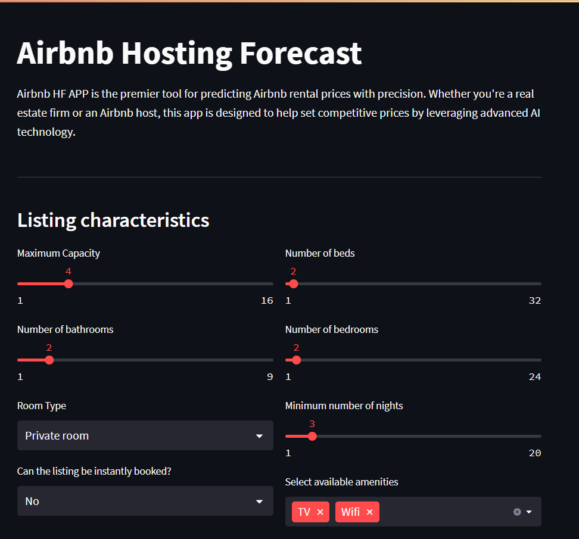

# Airbnb HF APP

Welcome to Airbnb HF APP

Airbnb Hosting Forecast APP is the premier tool for predicting Airbnb rental prices with precision. Whether you're a real estate firm or an Airbnb host, this app is designed to help set competitive prices by leveraging advanced AI technology.

Features:

- Accurate Price Predictions: Utilize Machine Learning and Deep Learning algorithms to forecast rental prices based on a variety of listing characteristics, including capacity, number of beds, bathrooms, and more.

- Comprehensive Data Analysis: The app combines data from multiple sources, using listings and reviews datasets to provide a holistic view of the market.

- Cutting-edge AI Models: Built with frameworks like scikit-learn, TensorFlow, and PyTorch, the models incorporate transfer learning and custom functions to deliver reliable predictions.

- Statistical Inference & Hyperparameter Tuning: Employ a Bayesian perspective to refine models through statistical inference and optimal hyperparameter selection.

- Explainable AI (XAI): Overcome the black box problem with methods that make AI predictions transparent and understandable.

---

## Airbnb Hosting Forecast Tool

Simulate real estate market asset valuations with AI! Provide data about your Airbnb listing and get instant predictions.

- Listing Characteristics: Input details such as maximum capacity, number of beds, bathrooms, bedrooms, room type, and minimum number of nights to get tailored price predictions.
- Amenities & Instant Booking: Specify available amenities and whether the listing can be instantly booked to further refine the forecast.

---

## Easy-to-Use Interface

The user-friendly Streamlit app allows seamless access to the Airbnb Price Prediction tool. Simply click on the icon to start predicting and setting optimal prices for your listings.

---

## Advanced AI Techniques

- Machine Learning Models: Includes Bayesian Ridge Regression, Elastic Net Regression, Random Forest, Bayesian Random Forest, and XGBoost.
Deep Learning Models: Utilizes Artificial Neural Networks and Bayesian Neural Networks for enhanced prediction accuracy.
- Bayesian Optimization: Implements the TPE algorithm for hyperparameter tuning to ensure the best model performance.

---

## Home Page 

---

<i>Contato</i>  
 

